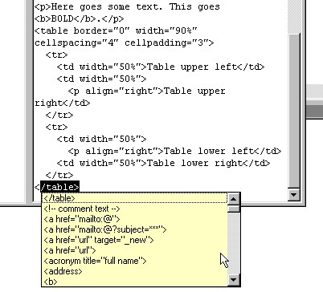



## HTML Autocomplete

### Description

This code autocompletes in a Rich text box, and it displays a list of suggestions (much like the VB code editor that displays properties, see screenshot). It trigs on < and first suggestion is last un-closed HTML tag, by the help of a treeview showing the hierarchy.

It's the code part of "yet another HTML editor", I won't bother you with that.

The list technique can of course be used for anything else, but for now it's HTML.

This is my first submission, a thank you for all useful code you all have provided me with. If you hate it, be kind.
 
### More Info
 

             |
---                |---
**Submitted On**   |2002-06-17 14:41:40
**By**             |[Harald Staff](https://github.com/Planet-Source-Code/PSCIndex/blob/master/ByAuthor/harald-staff.md)
**Level**          |Intermediate
**User Rating**    |4.6 (46 globes from 10 users)
**Compatibility**  |VB 6\.0
**Category**       |[Internet/ HTML](https://github.com/Planet-Source-Code/PSCIndex/blob/master/ByCategory/internet-html__1-34.md)
**World**          |[Visual Basic](https://github.com/Planet-Source-Code/PSCIndex/blob/master/ByWorld/visual-basic.md)
**Archive File**   |[HTML\_Autoc953936172002\.zip](https://github.com/Planet-Source-Code/harald-staff-html-autocomplete__1-35947/archive/master.zip)

